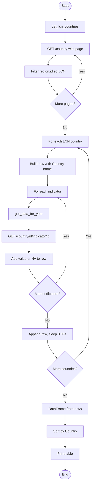

# my_good_query.py — Script documentation

> Cursor-oriented reference for the World Bank API query script: overview, endpoints, data structures, flow diagram, and usage.

**Note:** This doc is not updated automatically. If you change `my_good_query.py` (endpoints, indicators, parameters, or flow), update this README to match.

---

## Overview

**Purpose:** Fetch World Bank development indicators for Latin America & Caribbean (LCN) for a given year and display as a country-by-indicator table.

**Data source:** World Bank API. Public; no API key required.

**Stack:** Python 3, `requests`, `pandas`. Base URL: `https://api.worldbank.org/v2`.

**Output:** A pandas DataFrame with columns:

- `Country`
- `Life expectancy`
- `DPT3 Immunization rate`
- `Health expenditure (% GDP)`

One row per LCN country; rows sorted by `Country`.

**Indicator codes (API ID → display name):**

| API ID | Display name |
|--------|--------------|
| `SP.DYN.LE00.IN` | Life expectancy |
| `SH.IMM.IDPT` | DPT3 Immunization rate |
| `SH.XPD.CHEX.GD.ZS` | Health expenditure (% GDP) |

**Flow (high level):**

1. List all countries from the API, filter to region **LCN** (Latin America & Caribbean).
2. For each LCN country, request the three indicators for a fixed year (e.g. 2023).
3. Build a table: one row per country, columns = Country + the three indicator values.
4. Sort by country name and print as a pandas DataFrame.

---

## API endpoints and parameters

Base URL: **`https://api.worldbank.org/v2`**.

All responses are JSON. The first element is metadata (e.g. `pages` for pagination); the second element is the data array.

| Endpoint | Method | Purpose | Parameters |
|----------|--------|---------|------------|
| `/country` | GET | List countries (script then filters by region in code) | `format=json`, `per_page=1000`, `page` (pagination) |
| `/country/{country_id}/indicator/{indicator_id}` | GET | One indicator value for one country and year | `format=json`, `date={year}` (e.g. `2023`) |

**Example requests:**

- List countries (page 1):  
  `GET https://api.worldbank.org/v2/country?format=json&per_page=1000&page=1`
- Indicator for one country/year:  
  `GET https://api.worldbank.org/v2/country/ARG/indicator/SP.DYN.LE00.IN?format=json&date=2023`

**Key IDs:**

- Region: **`LCN`** (Latin America & Caribbean).
- Indicator IDs: see the table in [Overview](#overview).

---

## Data structures

### Country list response

- **Shape:** `[meta, data]`.
- **`meta`:** Object with e.g. `pages` (total pages). Script uses `meta["pages"]` for pagination.
- **`data`:** Array of country objects. Each country has:
  - `id` — country code (e.g. `ARG`).
  - `name` — country name.
  - `region` — object with `id` (e.g. `LCN`).

The script keeps only countries where `region.id == "LCN"`.

### Indicator response

- **Shape:** `[meta, data]`.
- **`data`:** Array of objects (often one element per year). Each has a `value` field (numeric or `null`).
- **Script usage:** It takes `data[0]["value"]` when `data` is non-empty; otherwise it uses `"NA"`. The script also maps `None` (null) to `"NA"` when building rows.

---

## Flow diagram

Control and data flow for `my_good_query.py`:

*To view the diagram: open this file on GitHub, or install a Mermaid-capable Markdown extension (e.g. "Markdown Preview Mermaid Support") in Cursor/VS Code.*



---

## Usage instructions

### Prerequisites

- Python 3
- `requests` and `pandas`

Install dependencies:

```bash
pip install requests pandas
```

### How to run

From the repo root:

```bash
python dsai/01_query_api/my_good_query.py
```

From `01_query_api`:

```bash
cd dsai/01_query_api
python my_good_query.py
```

### Behavior

- The script is self-contained: no `.env` or command-line arguments.
- Year and indicator set are fixed in the script (e.g. year `2023` and the three indicators above).
- A `time.sleep(0.05)` delay is applied after each country to reduce request rate.

---

← [Back to 01_query_api README](README.md)
