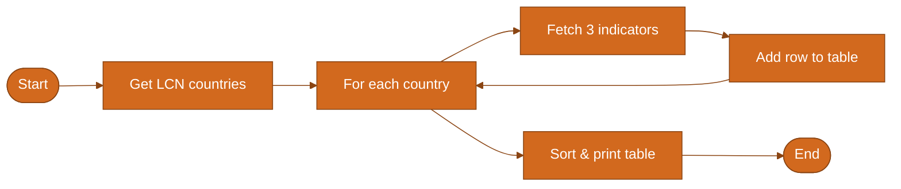

# <span style="color:#2563eb">📄 My Good Query — User Guide</span>

> A short guide to what this script does and what you’ll see when you run it.

**Developer reference:** [README_my_good_query_developer.md](README_my_good_query_developer.md) — API details, data structures, and full flow diagram.

---

## <span style="color:#2563eb">📑 Table of Contents</span>

- [What You Get](#-what-you-get)
- [What the Script Does](#-what-the-script-does)
- [The Data](#-the-data)
- [How It Works (Flow)](#-how-it-works-flow)
- [How to Run It](#-how-to-run-it)
- [Related Files](#-related-files)

---

## <span style="color:#2563eb">📊 What You Get</span>

When you run the script, you get a **table** of health-related statistics for countries in **Latin America and the Caribbean**.

**Columns in the table:**

| Column | Meaning |
|--------|--------|
| **Country** | Country name |
| **Life expectancy** | Life expectancy at birth |
| **DPT3 Immunization rate** | Share of children receiving DPT3 vaccine |
| **Health expenditure (% GDP)** | Health spending as % of GDP |

One row per country; rows are sorted alphabetically by country name. Missing values appear as **NA**.

**Script file:** [my_good_query.py](my_good_query.py)

---

## <span style="color:#2563eb">🎯 What the Script Does</span>

The script talks to the **World Bank API** (no account or API key needed). It:

1. Finds all countries in the Latin America & Caribbean region.
2. For each country, fetches the three indicators above for a fixed year (e.g. 2023).
3. Builds the table and prints it.

Data source: [World Bank API](https://api.worldbank.org/). The script is self-contained: no `.env` or command-line options.

---

## <span style="color:#2563eb">📈 The Data</span>

- **Region:** Latin America & Caribbean (World Bank code: **LCN**).
- **Indicators:** Life expectancy, DPT3 immunization rate, health expenditure (% GDP).
- **Year:** Set inside the script (e.g. 2023). To change it, edit [my_good_query.py](my_good_query.py).

The script adds a short pause between countries to be gentle on the API.

---

## <span style="color:#2563eb">🔄 How It Works (Flow)</span>

Below is a compact view of the script’s flow. It fetches countries, filters to LCN, then for each country fetches the three indicators and builds the table.

*To see the diagram: open this file in an editor or viewer that supports Mermaid (e.g. Cursor/VS Code with a Mermaid extension, or GitHub).*



---

## <span style="color:#2563eb">▶️ How to Run It</span>

**You need:** Python 3 plus `requests` and `pandas`. Install once:

```bash
pip install requests pandas
```

**Run from the project root:**

```bash
python dsai/01_query_api/my_good_query.py
```

**Or from the folder:**

```bash
cd dsai/01_query_api
python my_good_query.py
```

The table is printed in the terminal. No files are created unless you change the script to save output.

---

## <span style="color:#2563eb">🔗 Related Files</span>

| File | Purpose |
|------|--------|
| [my_good_query.py](my_good_query.py) | The script that fetches and prints the table |
| [README.md](README.md) | Main guide for the *query_api* folder |
| [LAB_your_good_api_query.md](LAB_your_good_api_query.md) | Lab for building your own API query |
| [ACTIVITY_your_api_query.md](ACTIVITY_your_api_query.md) | Activity: make your first API query |
| [README_my_good_query_developer.md](README_my_good_query_developer.md) | Developer doc: API, data structures, full flow |

---

← [Back to 01_query_api README](README.md)
