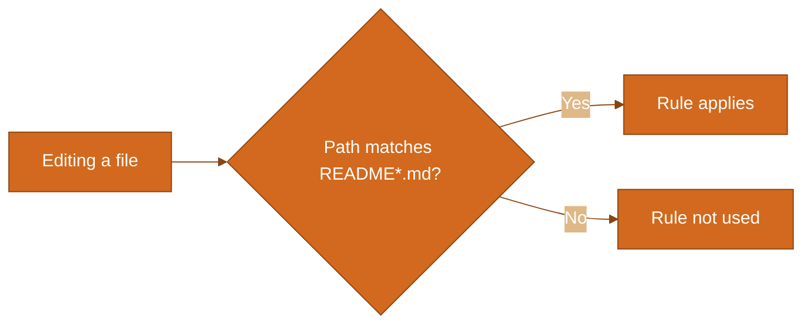

# 📄 README Style Rule — User Guide

> What the *readme-style* rule is, when it applies, and what it asks for when you or the AI write user-facing READMEs.

**Rule file:** [readme-style.mdc](readme-style.mdc)

---

## 📑 Table of Contents

- [What This Rule Is](#-what-this-rule-is)
- [When It Applies](#-when-it-applies)
- [What It Asks For](#-what-it-asks-for)
- [Quick Checklist](#-quick-checklist)
- [Related Files](#-related-files)

---

## 📋 What This Rule Is

The **readme-style** rule tells Cursor how to format user-facing READMEs. User-facing means docs for people who are reading the output of a script or using a tool, not only developers editing code.

When you (or the AI) create or update a README that matches the rule’s pattern, the rule is used to keep the doc short, scannable, and consistent: table of contents, section headers with icons, links to files, and compact brown flow diagrams where needed.

---

## ⏱ When It Applies

The rule applies when working with files whose path matches **`**/README*.md`** (any README with a name starting with `README` and ending in `.md`). It does not apply to every conversation; only when such a file is in context or being edited.

---

## 📐 What It Asks For

| Area | Requirement |
|------|-------------|
| **Length** | Maximum 1000 words; concise and scannable. |
| **Audience** | Readers of output or users of the tool; avoid developer-only jargon. |
| **Table of contents** | At the top, with anchor links to each section. |
| **Section headers** | One icon (emoji) per section (e.g. `## 📑 Table of Contents`). Use plain markdown so headers render on GitHub; in Cursor/VS Code you can use header color #DD4633: `## 📑 Title`. |
| **Links** | Hyperlinks to relevant repo files (relative paths); include a “Related files” (or “See also”) section. |
| **Diagrams** | If you use Mermaid flowcharts: one-screen fit (e.g. `flowchart LR`, fewer nodes) and brown theme via `themeVariables`. |

The full, authoritative list is in [readme-style.mdc](readme-style.mdc).

---

## ✅ Quick Checklist

Before considering a user-facing README done, the rule expects:

- [ ] TOC at top with anchor links
- [ ] Section headers: icon + title (plain `## 📑 Title` for GitHub; color #DD4633 in editors that support it)
- [ ] Max 1000 words
- [ ] Hyperlinks to relevant files (script, main README, related docs)
- [ ] Any flow diagram: one-screen fit + brown Mermaid theme
- [ ] Written for user/reader of output, not only developers

---

## 🔗 Related Files

| File | Purpose |
|------|--------|
| [readme-style.mdc](readme-style.mdc) | The Cursor rule (full requirements and examples). |
| [README_readme-style.md](README_readme-style.md) | This guide. |

---

← Back to [.cursor/rules](.) (project rules folder)
